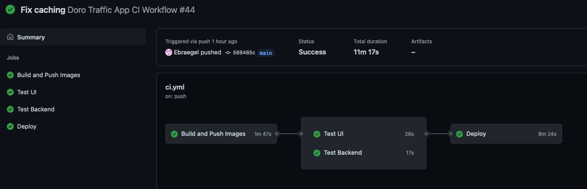
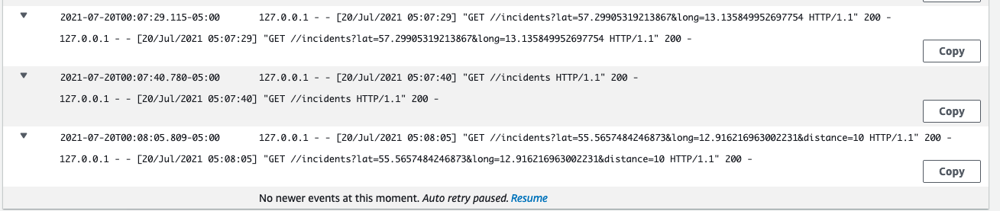

Backend coding challenge
========================

Here's my take on the Doro backend coding challenge. Here are the main areas I focused on, in roughly reverse order of how heavily I focused on them:

### UI
* [./ui](./ui)
* Extremely minimalistic :)
* I didn't quite figure out how to properly get location data, so the ui is currently sending hard-coded lat/long to the backend :(

### Backend
* [./backend](./backend)
* Simple REST API written in Flask
* `/healthcheck` and `/incidents` endpoints
* `/indcidents` shows all known traffic incidents by default, and accepts optional query params `lat`, `long`, and `distance` to filter incidents to those within a certain radius of a location
  * `distance` defaults to 30km if `lat`/`long` are provided without it
* `/incidents` caches results from the SR traffic API for 15 minutes to avoid hammering it with every request 

### Development environment
* See [DEVELOPMENT.md](DEVELOPMENT.md) for a bit more detail
* Dockerized and managed using [docker-compose](docker-compose.yml) and a few scripts in [./bin](./bin)

### CI/CD
* [.github/workflows/.ci.yml](.github/workflows/ci.yml)
* Uses Github Actions
* Builds ui, backend, and nginx images and pushes them to a private AWS ECR repo
* Runs ui and backend tests using the same images
* Deploys images to AWS ECS

### Infrastructure (as code!)
* [doro_traffic_app_cdk/doro_traffic_app_cdk_stack.py](doro_traffic_app_cdk/doro_traffic_app_cdk_stack.py)
* Uses CDK to create/configure VPC, ECR container registries, cluster, tasks, containers, load balancer, and logging
* Containers log to stdout which is shipped to CloudWatch

### Limitations and possible future work
* Does not do any kind of realtime updating of connected clients. All updates are request-based. I had initially considered looking at an AppSync and GraphQL-based solution, but had to go with something much simpler in the interest of time. I also considered the possibility of using websocket connections, coupled with a periodic asynchronous job that refreshed a cache of incidents from the SR traffic API and then pushed updates to clients who hadn't seen them before, but again, had to scrap it for time constraints.
* HTTP only. Certificate request is still pending validation, otherwise SSL would be the next thing to set up. 
* As mentioned in the UI section, I hardcoded some lat/long coordinates as a placeholder, and never got time to figure out how to get location data for real. IIRC one problem was the unencrypted connection, so if I'd managed to set up SSL, I may have been able to make more progress there.
* Test coverage is sparse. No post-deploy tests.
* No qc/int/etc environments - unit tests pass and it goes straight to prod. Would prefer to, e.g., deploy to a qc environment for remote post-deploy testing, load testing, etc, before allowing the workflow to deploy to prod.
* Application webservers are not very production-ready, but at least they're behind a nginx reverse proxy
* Should compile JS and serve as static assets from nginx
* Could automate CDK infrastructure updates in the GitHub workflow

Thanks for looking!

Erik

----------

Traffic was a nightmare
-----------------------

Is there anything more annoying than getting stuck in traffic? Even if you can pull up Google Maps and check the traffic situation the sad reality is that the times you get stuck in traffic your forgot to check.

The challenge is to create a service to help with this, and to create a simple app UI that uses this service.
This service will use a public traffic incident system as source for sending updates to geo-located connected clients.
We want a REST or graphQL API for the alert service.

Think about scoping and time. Don't overspend your time.

Feel free to use 3rd party providers for SMS, email etc. Twilio is a popular one

Coding Challenge
----------------

# Requirements

- [ ] We want to pull data from the [ Sveriges Radion Trafik API](https://sverigesradio.se/api/documentation/v2/metoder/trafik.html)
- [ ] A client must provide a geolocation for traffic notifications
- [ ] A client can update the geolocation for traffic notifications
- [ ] A client shows a relevant traffic incident that contains at a minimum
  - [ ] Priority
  - [ ] Title
  - [ ] Location
  - [ ] Description
  - [ ] Category

# Bonus if you include
- [ ] A client can register and receive update alerts using email or SMS (phone mumber) as identifier 
- [ ] A registred client will automatically unregister after 24 hours (to be polite)
- [ ] A registred client can unsubscribe from the service

# Tech requirements

- React for the frontend
- CSSinJS is a plus, but not a requirement (JSS, styled-components)
- Python, Java or node.js are good alternatives for the backend
- Tests (appropriate tests to the solution chosen)
- Linter (of your choice)

# Instructions

- Fork this repo, or if you don't want to fork, make your own private and invite us
- Build a clean and robust solution 
- Publish on your chosen cloud provider
- Let us know that you've completed the challenge

# Extra

Before we talk:
- Do surprise us, we love it
- Guide us through what you did; in commits or other way
- So we like you (probably since you did the challenge): But what stands out, why you?

When we talk
------------

We expect you talk talk about

* Description of solution.
* Whether the solution focuses on back-end, front-end or if it's full stack.
* Reasoning behind your technical choices, including architectural. 
* Trade-offs you might have made, anything you left out, or what you might do differently if you were to spend additional time on the project.
* Link to to the hosted application where applicable.

How we review
-------------

Your application will be reviewed by our engineers. We do take into consideration your experience level.

* **Architecture**: how clean is the separation between the front-end and the back-end?
* **Clarity**: does the README clearly and concisely explains the problem and solution? Are technical tradeoffs explained?
* **Correctness**: does the application do what was asked? If there is anything missing, does the README explain why it is missing?
* **Code quality**: is the code simple, easy to understand, and maintainable?  Are there any code smells or other red flags? Does object-oriented code follows principles such as the single responsibility principle? Is the coding style consistent with the language's guidelines? Is it consistent throughout the codebase?
* **Security**: are there any obvious vulnerability?
* **Testing**: how thorough are the automated tests? Will they be difficult to change if the requirements of the application were to change? Are there some unit and some integration tests?
	* We're not looking for full coverage (given time constraint) but just trying to get a feel for your testing skills.
* **UX**: is the web interface understandable and pleasing to use? Is the API intuitive?
* **Technical choices**: do choices of libraries, databases, architecture etc. seem appropriate for the chosen application?

Bonus point (those items are optional):

* **Scalability**: will technical choices scale well? If not, is there a discussion of those choices in the README? 
* **Production-readiness**: does the code include monitoring? logging? proper error handling?

# License

This project is licensed under MIT. Feel free to use it anyway you see fit.

